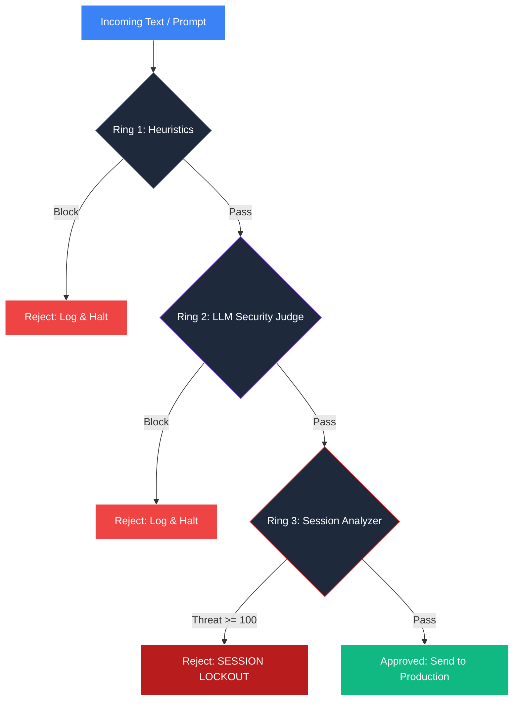

# Enterprise AI Web Application Firewall (AI-WAF) 🛡️

A production-grade, multi-ring security pipeline designed to intercept, evaluate, and sanitize LLM-generated text and user prompts before they hit production systems.

## 🏗️ 3-Ring Architecture

This firewall uses a defense-in-depth approach, combining speed, intelligence, and behavioral tracking.



### 🔹 Ring 1: Heuristics & Entropy (Speed)
Scans for high-entropy obfuscation (e.g., Base64, Hex) and known prompt-injection signatures. Extremely fast (~1ms).

### 🔹 Ring 2: Local AI Judge (Intelligence)
A locally-hosted, custom fine-tuned `Gemma-2B-it` LLM (via QLoRA) trained to detect subtle "Prohibited Claims" and "Tone Violations" based on corporate brand-safety guidelines. Evaluates the deep context of the text.

### 🔹 Ring 3: Behavioral Intelligence (Memory)
A stateful analyzer that shadows the user's session. It tracks repeated Ring 1/Ring 2 violations. If a user exhibits "Adversarial Probing" (e.g., trying to bypass the filter multiple times), it permanently locks their session.

### 🔹 Ring 4: Cryptographic Audit
Every pass or block is logged and digitally signed using `HMAC-SHA256` to ensure the compliance logs cannot be tampered with by an attacker.

## 🚀 Running Locally

1. Install dependencies:
```bash
pip install -r requirements.txt
```

2. Run the Streamlit Dashboard:
```bash
streamlit run app.py
```
*(Note: If you do not have a local GPU, the system will automatically fall back to a Fast-Mock mode to prevent your CPU from freezing).*
